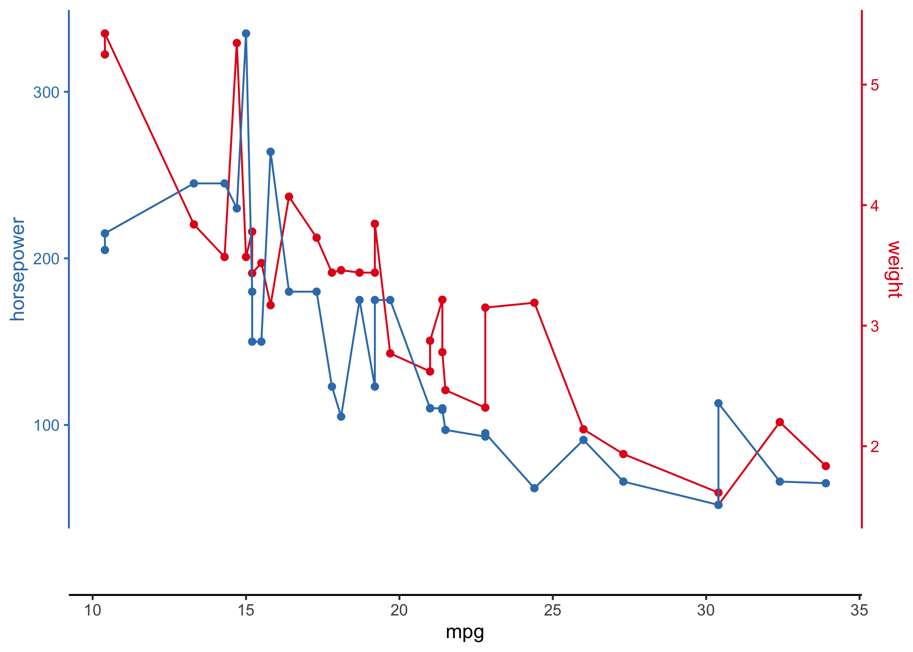
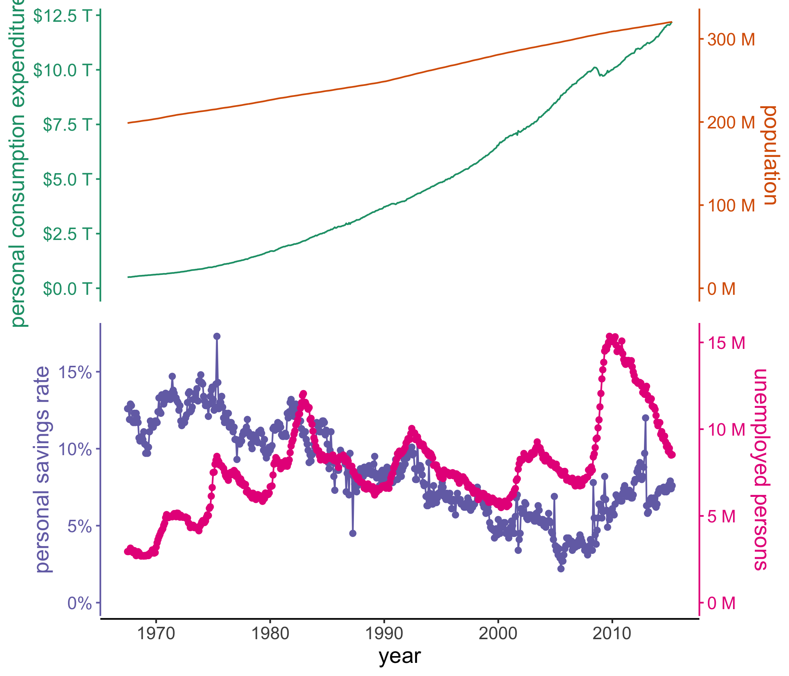

<!-- README.md is generated from README.Rmd. Please edit that file -->

# ggstackplot

<!-- badges: start -->

[](https://github.com/KopfLab/ggstackplot/actions/workflows/R-CMD-check.yaml)
[](https://app.codecov.io/gh/kopflab/ggstackplot)
[](https://ggstackplot.kopflab.org/)
<!-- badges: end -->

## About

Have you ever wanted to create (partly) overlapping line plots with
matched color-coding of the data and axes? These kinds of plots are
common, for example, in climatology and oceanography research but there
is not an easy way to create them with ggplot facets. The ggstackplot
package builds on [ggplot2](https://ggplot2.tidyverse.org/) to provide a
straightforward approach to building these kinds of plots while
retaining the powerful grammar of graphics functionality of ggplots.

## Installation

You can install the development version of ggstackplot from
[GitHub](https://github.com/) with:

    # install.packages("pak")
    pak::pak("KopfLab/ggstackplot")

## Show me some code

``` r
library(ggstackplot)

# using R's built-in mtcars dataset
mtcars |> 
  ggstackplot(
    # define shared x axis
    x = mpg, 
    # define multiple y axes
    y = c("weight" = wt, "horsepower" = hp),
    # set colors
    color = c("#E41A1C", "#377EB8"),
    # set to complete overlap
    overlap = 1
  )
```



## Show me some climate data

``` r
# download a recent dataset from the public climate data repository PANGAEA
dataset <- pangaear::pg_data(doi = "10.1594/PANGAEA.967047")[[1]]

# show what some of these data look like
dataset$data[
  c("Depth ice/snow [m] (Top Depth)", 
    "Age [ka BP]", 
    "[SO4]2- [ng/g] (Ion chromatography)")] |>
  head() |> knitr::kable()
```

| Depth ice/snow \[m\] (Top Depth) | Age \[ka BP\] | \[SO4\]2- \[ng/g\] (Ion chromatography) |
|---------------------------------:|--------------:|----------------------------------------:|
|                          160.215 |       1.20662 |                                   52.00 |
|                          160.183 |       1.20300 |                                  165.00 |
|                          160.151 |       1.20276 |                                   93.50 |
|                          160.022 |       1.20191 |                                   42.25 |
|                          159.990 |       1.20155 |                                   74.50 |
|                          159.958 |       1.20130 |                                  104.50 |

**These data were kindly made available on
[PANGEA](https://doi.org/10.1594/PANGAEA.967047) by Sigl et
al. (2024).**

Full citation:

> Sigl, Michael; Gabriel, Imogen; Hutchison, William; Burke, Andrea
> (2024): Sulfate concentration and sulfur isotope data from Greenland
> TUNU2013 ice-core samples between 740-765 CE \[dataset\]. PANGAEA,
> <https://doi.org/10.1594/PANGAEA.967047>

``` r
# visualize the data with ggstackplot
dataset$data |> 
  ggstackplot(
    x = "Age [ka BP]",
    y = c(
      # vertical stack of the measurements through time
      "sulfate [ng/g]" = "[SO4]2- [ng/g] (Ion chromatography)",
      "δ34S [‰]" = "δ34S [SO4]2- [‰ CDT] (Multi-collector ICP-MS (MC-IC...)",
      "Δ33S [‰]" = "Δ33S [SO4]2- [‰ CDT] (Multi-collector ICP-MS (MC-IC...)"
    ),
    # color palette
    palette = "Dark2",
    # partial overlap of the panels
    overlap = 0.4
  )
```


## Show me more

``` r
library(ggplot2)

# using the built-in economics dataset in ggplot2 to create a horizontal stack
# instead of vertical and using many of the customization features available
# with ggstackplot and ggplot2
ggplot2::economics |>
  ggstackplot(
    # define shared x axis
    x = date, 
    # define the stacked y axes
    y = c(pce, pop, psavert, unemploy),
    # pick the RColorBrewer Dark2 palette (good color contrast)
    palette = "Dark2",
    # overlay the pce & pop plots (1), then make a full break (0) to the once
    # again overlaye psavert & unemploy plots (1)
    overlap = c(1, 0, 1),
    # switch axes so unemploy and psavert are on the side where they are 
    # highest, respectively - not doing this here by changing the order of y
    # because we want pop and unemploy on the same side
    switch_axes = TRUE,
    # make shared axis space a bit smaller
    shared_axis_size = 0.15,
    # provide a base plot with shared graphics eelements among all plots
    template = 
      # it's a ggplot
      ggplot() +
      # use a line plot for all
      geom_line() +
      # we want the default stackplot theme
      theme_stackplot() +
      # add custom theme modifications, such as text size
      theme(text = element_text(size = 14)) +
      # make the shared axis a date axis
      scale_x_date("year") +
      # include y=0 for all plots to contextualize data better
      expand_limits(y = 0),
    # add plot specific elements
    add = 
      list(
        pce = 
          # show pce in trillions of dollars
          scale_y_continuous(
            "personal consumption expenditures", 
            # always keep the secondary axis duplicated so ggstackplot can
            # manage axis placement for you
            sec.axis = dup_axis(),
            # labeling function for the dollar units
            labels = function(x) sprintf("$%.1f T", x/1000),
          ),
        pop = 
          # show population in millions
          scale_y_continuous(
            "population", sec.axis = dup_axis(),
            labels = function(x) sprintf("%.0f M", x/1000)
          ),
        psavert = 
          # savings is in %
          scale_y_continuous(
            "personal savings rate", sec.axis = dup_axis(),
            labels = function(x) paste0(x, "%"),
          ) +
          # show data points in addition to line
          geom_point(),
        unemploy = 
          # unemploy in millions
          scale_y_continuous(
            "unemployed persons", sec.axis = dup_axis(),
            labels = function(x) sprintf("%.0f M", x/1000)
          ) +
          # show data points in addition to line
          geom_point()
      )
  )
```



## What else can I do with ggstackplot?

- check out the
  **[Features](https://ggstackplot.kopflab.org/articles/features.html)**
  vignette for full details on all available functionality
